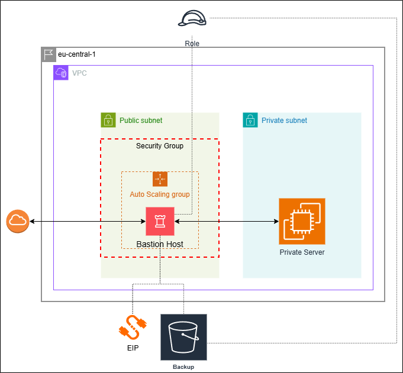

## [Project Idea Page](https://roadmap.sh/projects/bastion-host)
## Project Diagram

## Setup and Usage
1) Create `terraform/terraform.tfvars` file:
```
region        = "eu-central-1"
trusted_cidr  = "<ip>/32"
project_name  = "bastion-vpn-demo"

# to get trusted_cidr(IP)
curl https://checkip.amazonaws.com
```
2) Download and install openvpn-gui
3) Run the Terraform build:
```
terraform init
terraform plan
terraform apply
```
4) Save the `SSH key`:
```
terraform output -raw private_key_pem > demo-key.pem

# stored locally for demo
```
5) Get the `VPN profile`:
```
scp -i demo-key.pem ec2-user@$(terraform output -raw bastion_eip):/home/ec2-user/client.ovpn .

# If “REMOTE HOST IDENTIFICATION HAS CHANGED” warning run below and retry the scp
ssh-keygen -R $(terraform output -raw bastion_eip)
```
6) Place `client.ovpn` file in `\OpenVPN\config\client.ovpn`
7) Run OpenVPN GUI as Administrator, right-click the tray icon, Connect
8) SSH into the private instance (over the VPN):
```
ssh -i demo-key.pem ec2-user@$(terraform output -raw private_instance_private_ip)
```
9) Clean Up:
```
terraform destroy
```
